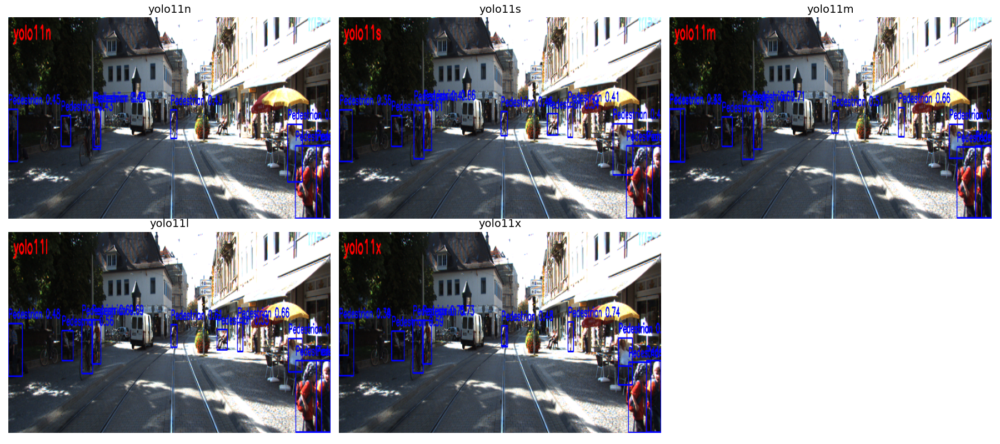
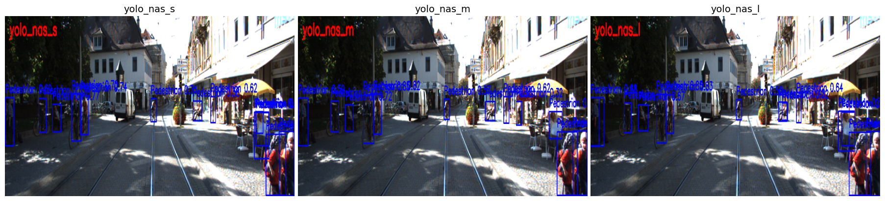
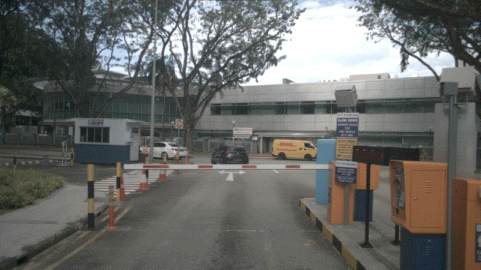

# Pedestrian Detection in Autonomous Driving System
Yolov11

Yolo-Nas

# 🧠 Pedestrian Detection using YOLOv11 Models

This project compares pedestrian detection performance across different YOLOv11 variants using KITTI raw dataset (`2011_09_26_drive_0091_sync`).
## 📹 Model Comparison (GIFs)

# Yolov11(FPS:33.33)
<table>
  <tr>
    <td align="center">
       
      
yolov11l

    </td>
    <td align="center">
       
      
yolov11m

    </td>
    <td align="center">
       
      
yolo11n

    </td>
  </tr>
  <tr>
    <td align="center">
       
      
yolo11s

    </td>
    <td align="center">
       
      
yolo11x

    </td>
  </tr>
</table>

# Yolo-Nas(FPS:33.33)
<table>
  <tr>
    <td align="center">
       
      
yolov-nas_s

    </td>
    <td align="center">
       
      
yolov-nas-m

    </td>
    <td align="center">
       
      
yolo1-nas-l

    </td>
  </tr>
</table>

# Yolo-RTMPose
<table>
  <tr>
    <td align="center">
       
      
yolov11l

    </td>
    <td align="center">
       
      
yolov11m

    </td>
    <td align="center">
       
      
yolo11n

    </td>
  </tr>
  <tr>
    <td align="center">
       
      
yolo11s

    </td>
    <td align="center">
       
      
yolo11x

    </td>
  </tr>
</table>

# Nuscene(map1,3)
<table>
  <tr>
    <td align="center">
       
      
[Map1]1

    </td>
    <td align="center">
       
      
[Map1]2

    </td>
    <td align="center">
       
      
[Map1]3

    </td>
  </tr>
  <tr>
    <td align="center">
       
      
[Map3]1

    </td>
    <td align="center">
       
      
[Map3]2

    </td>
    <td align="center">
       
      
[Map3]3

    </td>
    <td align="center">
       
      
[Map3]4

    </td>
  </tr>
</table>
